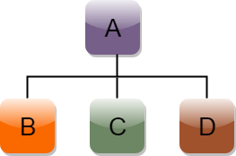

# Object Oriented Programming in C++

# Inheritance

### Definition
inheritance is a process in which one object acquires all the properties and behaviors of its parent object automatically. In such way, you can reuse, extend or modify the attributes and behaviors which are defined in other class.

## Types Of Inheritance

C++ supports five types of inheritance:

1. Single inheritance
2. Multiple inheritance
3. Hierarchical inheritance
4. Multilevel inheritance
5. Hybrid inheritance
    

## Single Inheritance in C++

Single inheritance is defined as the inheritance in which a derived class is inherited from the only one base class.

  
Where,
A is Base Class & B is Derived Class

## Multilevel Inheritance in C++

Multilevel inheritance is a process of deriving a class from another derived class.

## Multiple Inheritance in C++

Multiple inheritance is the process of deriving a new class that inherits the attributes from two or more classes.

## Hybrid Inheritance in C++

Hybrid inheritance is a combination of more than one type of inheritance.

## Hierarchical Inheritance in C++

Hierarchical inheritance is defined as the process of deriving more than one class from a base class.

## Access Specifiers :

#### Public: 
The members that are public in the base class are derived as public in the derived class if derived publicly. These are accessible from anywhere outside the class.

#### Private: 
Public or protected members of the base class become private members of the derived class when inherited privately. Private members are never inherited. 

#### Protected: 
The protected members cannot be accessed outside the class, but they can be inherited.

<table class="alt">
    <tbody>
        <tr>
            <th rowspan="2">Base class visibility</th>
            <th colspan="3">Derived class visibility</th>
        </tr>
        <tr>
            <th>Public</th>
            <th>Private</th>
            <th>Protected</th>
        </tr>
        <tr>
            <td>Private</td>
            <td>Not Inherited</td>
            <td>Not Inherited</td>
            <td>Not Inherited</td>
        </tr>
        <tr>
            <td>Protected</td>
            <td>Protected</td>
            <td>Private</td>
            <td>Protected</td>
        </tr>
        <tr>
            <td>Public</td>
            <td>Public</td>
            <td>Private</td>
            <td>Protected</td>
        </tr>
    </tbody>
</table>

Note : `private` access modifier can not be `Not Inherited`.
