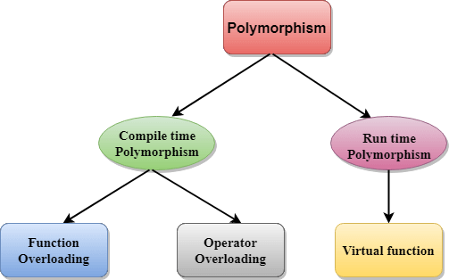

# Object Oriented Programming in C++

# Polymorphism

### Definition
Def 1 :Exisiting in multiple forms.

Def 2 : It is an object-oriented programming concept that refers to the ability of a variable, function, or object to take on multiple forms, which are when the behavior of the same object or function is different in different contexts.


### Types of Polymorphism
1. Compile - time Polymorphism.
2. Run - time Polymorphism.



### 1. Compile - time Polymorphism
Compile-time polymorphism is done by overloading an operator or function. It is also known as "static" or "early binding".

#### Types of Compile - time Polymorphism
    1. Function Overloading
    2. Operator Overloading


#### 1. Function Overloading
1. it can be achive by passing the function arguments/ parameters in the function

2. When we have two functions with the same name but different parameters, different functions are called depending on the number and data types of parameters. This is known as function overloading

```
class A 
{
    public:
        void sayHello()
        {
            cout<<"Hii, i am Suraj Patil"<<endl;
        }

        void sayHello(func_arguments)
        {
            cout<<"Hii"<<func_arguments<<endl;
        }

        void sayHello(func_arguments, func_arguments)
        {
            cout<<"Hii"<<func_arguments<<endl<<func_arguments<<" years Old.";
        }

        void sayHello(func_arguments, func_arguments, func_arguments)
        {
            cout<<endl<<"Hii,"<<func_arguments<<endl<<func_arguments<<" years Old."<<endl<<"Living in "<<func_arguments<<endl;
        }
};

int main()
{
    A obj1;
    obj1.sayHello();
    cout<<endl;

    obj1.sayHello("Suraj Patil", 21);
    cout<<endl;

    obj1.sayHello("Suraj Patil", 21, "Banglore");
    cout << endl;

    return 0;
}

```

#### 2. Operator Overloading

When an operator is updated to be used for user-defined data types (objects etc.), this is known as operator overloading. To use operator overloading, at least one operand must be a user-defined data type.

Note:
1. A user-defined type must be present in at least one operand.
2. `".", "::", typeid, size, ".*"`, and C++'s single ternary operator, `"?:"`, are among the operators that cannot be overloaded.

NOTE: 
These are some of the operators that can be overloaded in C++ :

1. Arithmetic operators : `- , + , / , * , % and -=, +=, /= , *= , %=`

2. Boolean algebra : `!=, ==, > ,< ,>=, <= , && ,||`

3. Bit manipulation : `&, |, ^ ,<< ,>> and |=, &= ,>>=, <<=, ^=`

4. Memory management : `new[], new, delete[], delete`


